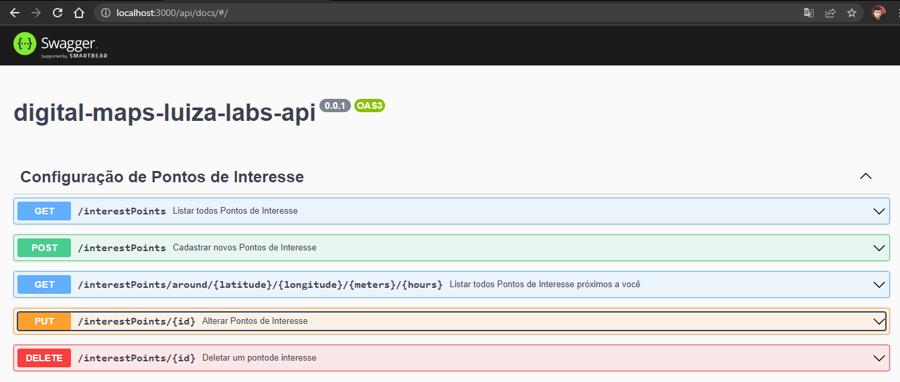

# DigitalMaps

[DigitalMaps](https://github.com/MatheusSBatista/digital-maps-luiza-labs-api) Desafio LuizaLabs para cadastrar e buscar pontos de interesse.
### Documentação API

Para a documentação é utilizado o [Swagger](https://swagger.io/). Ferramenta que provê interface para testes.



Por padrão a documentação está disponível no endpoint `/api/docs/#/`.

## Desenvolvimento

### Requisitos

```
* NodeJs
* Mysql
```
### Instalando as dependencias

```bash
$ npm install
ou
$ yarn
```
### Execução

Após preparar seu ambiente para iniciar a aplicação execute os comandos abaixo na pasta raiz do projeto.

```bash
# development
$ npm run start
ou
$ yarn start

# watch mode
$ npm run start:dev
ou
$ yarn start:dev

# production mode
$ npm run start:prod
ou
$ yarn start:prod

```

### Testes

```bash
# unit tests
$ npm run test
ou
$ yarn test

# test coverage
$ npm run test:cov
ou
$ yarn test:cov

```


